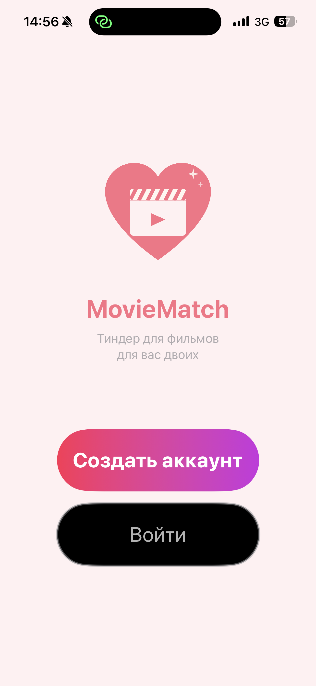
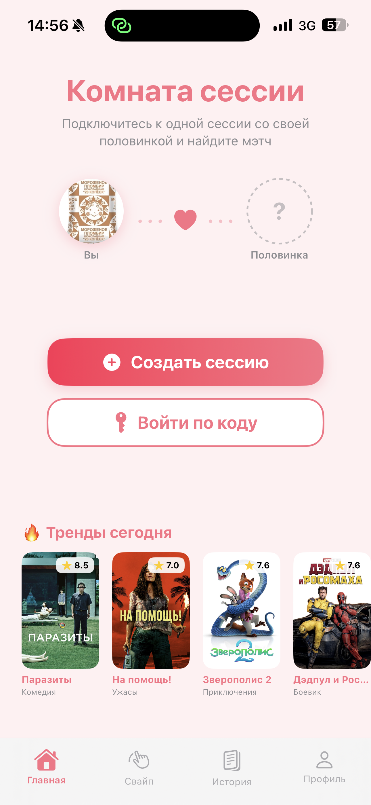
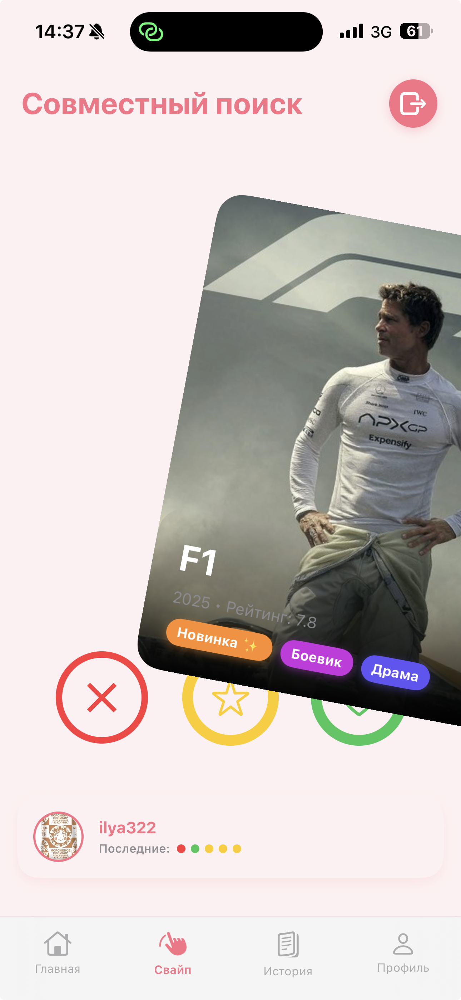
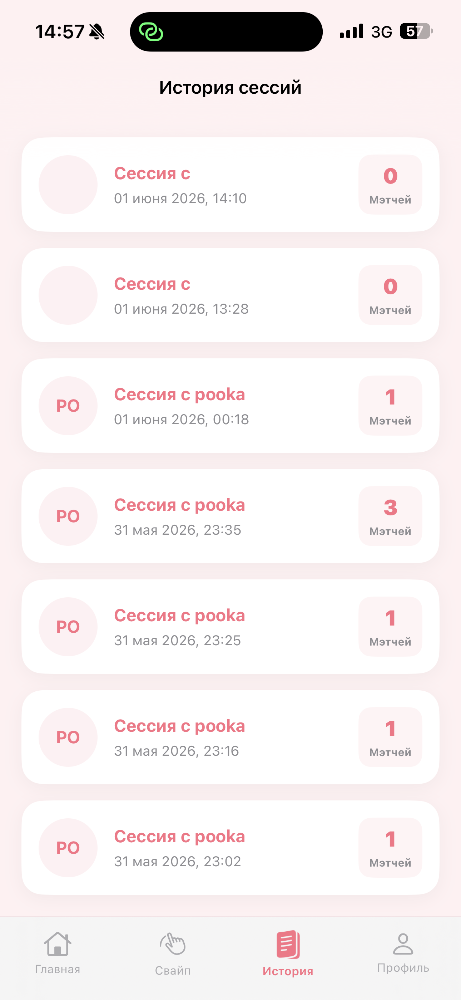
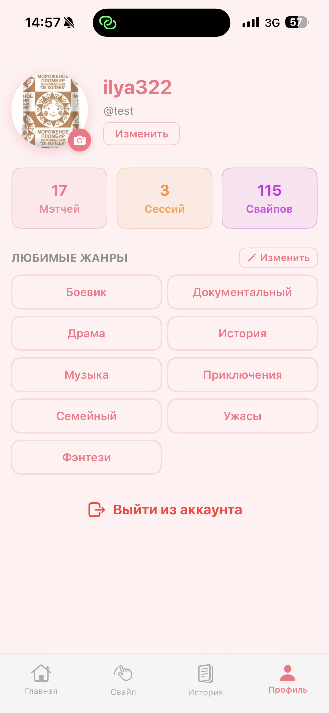

<div align="center">

# MovieMatch 🎬❤️

**Tinder for movies — find a film you both want to watch**

[](https://swift.org)
[](https://developer.apple.com/xcode/swiftui/)
[](https://firebase.google.com)
[](https://developer.apple.com/ios/)
[](https://www.themoviedb.org/documentation/api)

</div>

---

## 📱 Screenshots

<div align="center">

| Splash | Home | Swipe | History | Profile |
|:------:|:----:|:-----:|:-------:|:-------:|
|  |  |  |  |  |
| Onboarding screen with app icon and two action buttons | Session room with live trending movies feed | Co-op swipe mode with partner's action dots | Full archive of past sessions with match count | Profile with custom avatar, genres and activity stats |

</div>

---

## 🚀 What is MovieMatch

Can't agree on a movie with your partner? MovieMatch fixes that in 5 minutes.

Create a room → share a 6-digit code → swipe films independently → the app finds what you **both** like and shows a match. No more "I don't know, you pick."

---

## ✨ Key Features

### 🤝 Real-time Multiplayer
Two users join one session via a code. Firebase Firestore syncs all actions instantly via `addSnapshotListener()` — no manual refresh needed.

### 🎯 Smart Genre Matching
Before swiping the app computes the **intersection** of both users' genre preferences. If there's no overlap — it falls back to the union. Both users always see relevant films.

### 🟢🔴🟡 Partner Activity Indicator
While swiping, 5 colored dots at the bottom show the partner's last 5 actions in real time: green — like, red — dislike, yellow — superlike.

### 📋 Session History with Full Decision Map
When a session ends the entire document is archived to Firebase. The history screen shows every film's poster, each person's action and which ones matched.

### 🔄 Dual-mode Swiping
Without a session — solo mode with a shuffled feed filtered by your genres. In a session — co-op mode where both users see films in the same order.

### ✂️ Custom Avatar Cropper
Circle-mask cropper like Instagram. Handles simultaneous `DragGesture` + `MagnificationGesture`. Minimum resolution validation — the Done button is disabled if the crop area is too small.

### 🏛️ MVVM Architecture
Clean separation of layers. `SessionViewModel` implements a finite state machine (`waiting → negotiating → active → ended`). All UI updates reactively via `@Published` with no manual redraws.

---

## 🏗️ Tech Stack

| Category | Technology |
|----------|-----------|
| Language | Swift 5.9 |
| UI | SwiftUI |
| Architecture | MVVM |
| Auth | Firebase Authentication |
| Database | Firebase Firestore (realtime) |
| Movies | TMDb API (500k+ titles, localized) |
| Dependencies | Swift Package Manager |
| Platform | iOS 17+ |

---

## 📂 Project Structure

```
MovieMatch/
├── Models/
│   ├── Movie.swift           # Codable movie model + genreDictionary
│   ├── Genre.swift           # Identifiable genre
│   ├── AppScreen.swift       # Navigation state enum
│   └── SwipeModifier.swift   # ViewModifier for swipe gestures
│
├── AuthManager/
│   ├── AuthManager.swift     # Registration and login via Firebase Auth
│   └── UserManager.swift     # Profile, avatar (base64), counters
│
├── Network/
│   └── NetworkManager.swift  # TMDb API, pagination, genre filtering
│
├── View/
│   ├── Loading/              # Splash screen
│   ├── Login/                # Login screen
│   ├── Register/             # Registration + genre selection
│   ├── Session/              # Home, ViewModel, session settings
│   ├── SelectView/           # Swipe screen, movie card
│   ├── ItsAMatch/            # Match screen with avatar animation
│   ├── HistoryOfMatch/       # Session history and detail map
│   └── Profile/              # Profile, settings, avatar cropper
│
└── ContentView.swift         # Root navigation + MainContainerView
```

---

## 🔥 How a Session Works

```
User A                        Firebase                      User B
  │                              │                              │
  │  generateRoomCode()          │                              │
  │ ────────────────────────────>│                              │
  │  listenToSession()           │   connectToRoom(code)        │
  │ <────────────────────────────│<────────────────────────────│
  │                              │  status: "negotiating"       │
  │   SessionSettingsView        │                              │
  │   (pick genres)              │   (pick genres)              │
  │   toggleReadyStatus()        │                              │
  │ ────────────────────────────>│   toggleReadyStatus()        │
  │                              │<────────────────────────────│
  │                              │  hostReady && guestReady     │
  │                              │  status: "active"            │
  │   SwipeView (co-op mode)     │   SwipeView (co-op mode)     │
  │   likeMovie(id)              │                              │
  │ ────────────────────────────>│   likeMovie(id)              │
  │                              │<────────────────────────────│
  │                              │  hostLikes ∩ guestLikes      │
  │        MatchView! 🎉         │        MatchView! 🎉         │
```

---

## 🗄️ Firestore Schema

```
users/{uid}
  ├── username: String
  ├── email: String
  ├── genres: [String]
  ├── avatarBase64: String          # JPEG 200×200, ~15 KB
  ├── matchesCount: Int
  ├── sessionCount: Int
  └── swipesCount: Int

sessions/{code}
  ├── hostId / guestId: String
  ├── hostName / guestName: String
  ├── hostAvatar / guestAvatar: String
  ├── hostGenres / guestGenres: [String]
  ├── genres: [String]              # intersection or union
  ├── status: "waiting" | "negotiating" | "active" | "ended"
  ├── hostLikes / guestLikes: [Int]
  ├── hostDislikes / guestDislikes: [Int]
  ├── hostFavorites / guestFavorites: [Int]
  ├── hostRecentActions / guestRecentActions: [String]   # last 5
  ├── moviesMetadata: {movieId: MovieObject}
  └── hostReady / guestReady: Bool

completed_sessions/{uuid}
  └── (session snapshot + endedAt: Timestamp)
```

---

## ⚙️ Setup

1. Clone the repository
```bash
git clone https://github.com/f0nlY/MovieMatch.git
```

2. Open `MovieMatch.xcodeproj` in Xcode 16+

3. Add your `GoogleService-Info.plist` from Firebase Console to the `MovieMatch/` folder

4. Get a free API key at [themoviedb.org](https://www.themoviedb.org/documentation/api) and replace it in `NetworkManager.swift`:
```swift
private let apiKey = "YOUR_KEY_HERE"
```

5. Build and run on a real device (iOS 17+)

---

## 📋 Requirements

- Xcode 16+
- iOS 17+
- Firebase account (free Spark plan)
- TMDb API key (free)

---

## 👨‍💻 Author

**Ilya Khmylko**

- GitHub: [@f0nlY](https://github.com/f0nlY)
- Telegram: [@f0nlik](https://t.me/f0nlik)

---

<div align="center">

</div>


<div align="center">

# MovieMatch 🎬❤️

**Tinder для фильмов — находи кино которое понравится вам обоим**

[](https://swift.org)
[](https://developer.apple.com/xcode/swiftui/)
[](https://firebase.google.com)
[](https://developer.apple.com/ios/)
[](https://www.themoviedb.org/documentation/api)

</div>

---

## 📱 Скриншоты

<div align="center">

| Сплэш | Главная | Свайп | История | Профиль |
|:-----:|:-------:|:-----:|:-------:|:-------:|
|  |  |  |  |  |
| Онбординг с иконкой и двумя кнопками | Комната сессии с живой лентой трендов | Совместный свайп с цветными точками партнёра | Архив всех сессий с количеством мэтчей | Профиль с аватаркой, жанрами и статистикой |

</div>

---

## 🚀 Что такое MovieMatch

Не можешь выбрать фильм с партнёром? MovieMatch решает это за 5 минут.

Создай комнату → поделись 6-значным кодом → свайпайте фильмы независимо → приложение найдёт то, что нравится **обоим** и покажет мэтч. Больше никаких «ну не знаю, ты выбирай».

---

## ✨ Ключевые фичи

### 🤝 Мультиплеер в реальном времени
Два пользователя подключаются к одной сессии по коду. Firebase Firestore синхронизирует все действия мгновенно через `addSnapshotListener()` — не надо обновлять экран вручную.

### 🎯 Умный подбор жанров
Перед началом приложение вычисляет **пересечение** жанровых предпочтений обоих. Если общих жанров нет — берёт объединение. Оба всегда видят релевантные фильмы.

### 🟢🔴🟡 Индикатор действий партнёра
Во время свайпинга снизу показаны последние 5 действий партнёра цветными точками: зелёный — лайк, красный — дизлайк, жёлтый — суперлайк. Обновляется в реальном времени.

### 📋 История сессий с картой решений
После завершения сессии все данные сохраняются в Firebase. В истории видны постеры фильмов, действия каждого участника и мэтчи — можно вернуться и посмотреть что смотрели вместе.

### 🔄 Dual-mode свайпинг
Без сессии — соло-режим с рандомной подборкой по твоим жанрам. В сессии — совместный режим с одинаковой очерёдностью фильмов для обоих партнёров.

### ✂️ Кастомный кроппер аватарки
Кроппер с круглой маской как в Instagram. Поддержка одновременного `DragGesture` + `MagnificationGesture`. Валидация минимального разрешения — кнопка «Готово» заблокирована если фото слишком маленькое.

### 🏛️ Архитектура MVVM
Чёткое разделение слоёв. `SessionViewModel` с конечным автоматом состояний (`waiting → negotiating → active → ended`). Весь UI реактивно обновляется через `@Published` без явных вызовов перерисовки.

---

## 🏗️ Технологии

| Категория | Технология |
|-----------|-----------|
| Язык | Swift 5.9 |
| UI | SwiftUI |
| Архитектура | MVVM |
| Аутентификация | Firebase Authentication |
| База данных | Firebase Firestore (realtime) |
| Фильмы | TMDb API (500k+ фильмов, ru-RU) |
| Зависимости | Swift Package Manager |
| Платформа | iOS 17+ |

---

## 📂 Структура проекта

```
MovieMatch/
├── Models/
│   ├── Movie.swift           # Codable-модель фильма + genreDictionary
│   ├── Genre.swift           # Идентифицируемый жанр
│   ├── AppScreen.swift       # Enum навигационных состояний
│   └── SwipeModifier.swift   # ViewModifier для жестов свайпа
│
├── AuthManager/
│   ├── AuthManager.swift     # Регистрация и вход через Firebase Auth
│   └── UserManager.swift     # Профиль, аватарка (base64), счётчики
│
├── Network/
│   └── NetworkManager.swift  # TMDb API, пагинация, фильтрация жанров
│
├── View/
│   ├── Loading/              # Сплэш-экран
│   ├── Login/                # Экран входа
│   ├── Register/             # Регистрация + выбор жанров
│   ├── Session/              # Главная, ViewModel, настройки сессии
│   ├── SelectView/           # Свайп-экран, карточка фильма
│   ├── ItsAMatch/            # Экран мэтча с анимацией
│   ├── HistoryOfMatch/       # История и детальная карта сессии
│   └── Profile/              # Профиль, настройки, кроппер аватарки
│
└── ContentView.swift         # Корневая навигация + MainContainerView
```

---

## 🔥 Как работает сессия

```
Пользователь A                Firebase                  Пользователь B
     │                           │                           │
     │  generateRoomCode()       │                           │
     │ ─────────────────────────>│                           │
     │  listenToSession()        │   connectToRoom(code)     │
     │ <─────────────────────────│<─────────────────────────│
     │                           │  status: "negotiating"    │
     │   SessionSettingsView     │                           │
     │   (выбор жанров)          │   (выбор жанров)          │
     │   toggleReadyStatus()     │                           │
     │ ─────────────────────────>│   toggleReadyStatus()     │
     │                           │<─────────────────────────│
     │                           │  hostReady && guestReady  │
     │                           │  status: "active"         │
     │   SwipeView (совместный)  │   SwipeView (совместный)  │
     │   likeMovie(id)           │                           │
     │ ─────────────────────────>│   likeMovie(id)           │
     │                           │<─────────────────────────│
     │                           │  hostLikes ∩ guestLikes   │
     │       MatchView! 🎉       │       MatchView! 🎉       │
```

---

## 🗄️ Структура Firestore

```
users/{uid}
  ├── username: String
  ├── email: String
  ├── genres: [String]
  ├── avatarBase64: String      # JPEG 200x200, ~15KB
  ├── matchesCount: Int
  ├── sessionCount: Int
  └── swipesCount: Int

sessions/{code}
  ├── hostId / guestId: String
  ├── hostName / guestName: String
  ├── hostAvatar / guestAvatar: String
  ├── hostGenres / guestGenres: [String]
  ├── genres: [String]          # пересечение или объединение
  ├── status: "waiting" | "negotiating" | "active" | "ended"
  ├── hostLikes / guestLikes: [Int]
  ├── hostDislikes / guestDislikes: [Int]
  ├── hostFavorites / guestFavorites: [Int]
  ├── hostRecentActions / guestRecentActions: [String]  # последние 5
  ├── moviesMetadata: {movieId: MovieObject}
  └── hostReady / guestReady: Bool

completed_sessions/{uuid}
  └── (копия sessions + endedAt: Timestamp)
```

---

## ⚙️ Установка

1. Клонируй репозиторий
```bash
git clone https://github.com/f0nlY/MovieMatch.git
```

2. Открой `MovieMatch.xcodeproj` в Xcode 16+

3. Добавь `GoogleService-Info.plist` от своего Firebase проекта в папку `MovieMatch/`

4. Получи API ключ на [themoviedb.org](https://www.themoviedb.org/documentation/api) и замени в `NetworkManager.swift`:
```swift
private let apiKey = "ВАШ_КЛЮЧ_ЗДЕСЬ"
```

5. Собери и запусти на реальном устройстве (iOS 17+)

---

## 📋 Требования

- Xcode 16+
- iOS 17+
- Аккаунт Firebase (бесплатный Spark plan)
- API ключ TMDb (бесплатно)

---

## 👨‍💻 Автор

**Ilya Khmylko**

- GitHub: [@f0nlY](https://github.com/f0nlY)
- Telegram: [@f0nlik](https://t.me/f0nlik)

---

<div align="center">

</div>
